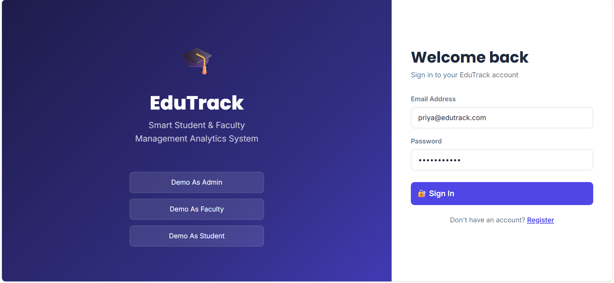

# 🎓 EduTrack

### Smart Student & Faculty Management Analytics System

EduTrack is a full-stack academic management platform designed to simplify academic operations for **administrators, faculty members, and students**.

The system provides role-based access to academic dashboards, attendance management, assignment handling, marks management, lecture note sharing, notifications, and academic analytics through a responsive web application.

---

## 🚀 Live Demo

**Frontend:**  
https://edu-track-vert.vercel.app/

---

## ✨ Key Features

### 🔐 Authentication & Authorization

- JWT-based authentication
- User registration and login
- Protected routes
- Role-based access control
- Separate dashboards for Admin, Faculty, and Student

### 👨‍💼 Admin Module

- Admin dashboard
- Student and faculty management
- Course management
- User role management
- Academic activity monitoring
- System analytics

### 👨‍🏫 Faculty Module

- Faculty dashboard
- Course management
- Attendance management
- Marks entry
- Assignment creation and management
- Lecture notes upload
- Academic analytics

### 👨‍🎓 Student Module

- Personalized student dashboard
- Attendance tracking
- Marks and performance monitoring
- Assignment submission
- Lecture notes access
- Notifications
- Academic analytics

---

## 🛠️ Tech Stack

| Layer | Technologies |
|---|---|
| Frontend | React.js, React Router DOM, Bootstrap 5, CSS3 |
| Backend | Node.js, Express.js |
| Authentication | JWT |
| Database | MySQL |
| Data Visualization | Chart.js |
| API Architecture | REST APIs |
| API Testing | Postman |
| Development | Git, GitHub, VS Code |

---

## 🏗️ System Architecture

```text
                         ┌─────────────────────┐
                         │        Users        │
                         │ Admin / Faculty /   │
                         │      Student       │
                         └──────────┬──────────┘
                                    │
                                    ▼
                         ┌─────────────────────┐
                         │   React Frontend    │
                         │  React Router + UI  │
                         └──────────┬──────────┘
                                    │
                              REST API
                                    │
                                    ▼
                         ┌─────────────────────┐
                         │  Node.js + Express  │
                         │   Backend Services  │
                         └──────────┬──────────┘
                                    │
                         JWT Authentication
                         & Authorization
                                    │
                                    ▼
                         ┌─────────────────────┐
                         │     MySQL Database  │
                         └─────────────────────┘
```

---

## 📸 Project Screenshots

### 🔐 Login



### 👨‍💼 Admin Dashboard


### 👨‍🏫 Faculty Dashboard


### 👨‍🎓 Student Dashboard


### 🗄️ MySQL Database


> Additional screenshots covering assignments, attendance, marks, lecture notes, notifications, courses, and other modules are available in the `screenshots/` directory.

---

## 📂 Project Structure

```text
EduTrack/
│
├── backend/
│   ├── config/
│   ├── middleware/
│   ├── routes/
│   ├── uploads/
│   └── server.js
│
├── frontend/
│   ├── public/
│   └── src/
│       ├── components/
│       ├── context/
│       ├── pages/
│       └── utils/
│
├── screenshots/
│
├── xml/
│
├── database.sql
├── .gitignore
└── README.md
```

---

## ⚙️ Local Setup

### 1. Clone the Repository

```bash
git clone https://github.com/Akshitha363/EduTrack.git
cd EduTrack
```

### 2. Backend Setup

```bash
cd backend
npm install
npm run dev
```

The backend will start on the configured local port.

### 3. Frontend Setup

Open a new terminal:

```bash
cd frontend
npm install
npm start
```

The frontend will start on the configured development port.

---

## 🗄️ Database Setup

EduTrack uses **MySQL** as its database.

### Create the Database

```sql
CREATE DATABASE edutrack_db;
```

### Import the Database

```bash
mysql -u root -p edutrack_db < database.sql
```

Alternatively, `database.sql` can be imported using **MySQL Workbench**.

---

## 🔗 API Modules

The backend follows a REST API architecture with modules for:

- Authentication
- User Management
- Courses
- Assignments
- Attendance
- Marks
- Lecture Notes
- Notifications
- Academic Analytics

---

## 🔒 Security

The application implements several security mechanisms:

- JWT-based authentication
- Protected API routes
- Role-based authorization
- Password encryption
- Session-based access control
- Restricted access to role-specific functionality

---

## 📊 Academic Analytics

EduTrack uses **Chart.js** to visualize academic information and provide dashboard-based insights.

Examples include:

- Attendance statistics
- Student performance
- Marks analytics
- Course-related information
- Academic activity summaries

---

## 🧪 API Testing

The backend REST APIs can be tested using **Postman**.

The project includes API modules for authentication, users, courses, assignments, attendance, marks, lecture notes, and notifications.

---

## 🌱 Future Enhancements

- AI-based student performance prediction
- Real-time chat between students and faculty
- Email notification integration
- Online examination module
- Mobile application
- Cloud-based file storage
- Advanced academic analytics
- Automated performance recommendations

---

## 📚 Learning Outcomes

This project provided practical experience in:

- Full-stack web development
- React.js application development
- Node.js and Express.js
- REST API design
- JWT authentication
- Role-based access control
- MySQL database integration
- Data visualization using Chart.js
- File upload functionality
- Frontend-backend integration
- Git and GitHub
- Application deployment

---

## 👩‍💻 Author

**Akshitha Gasikanti**

B.Tech Information Technology Student  
Aspiring Software Engineer

GitHub: Akshitha363

---

## ⭐ Project Highlights

```text
✓ Full-Stack Web Application
✓ Role-Based Dashboards
✓ JWT Authentication
✓ REST API Architecture
✓ MySQL Database Integration
✓ Academic Analytics
✓ Attendance Management
✓ Assignment Management
✓ Marks Management
✓ Lecture Notes Management
✓ Notification System
✓ Responsive User Interface
```
